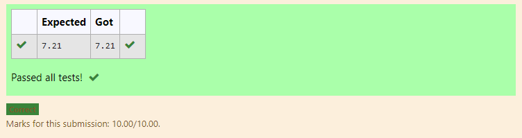

# DISTANCE-BETWEEN-TWO-POINTS

## AIM:
To write a python program to find the distance two 2 points
## ALGORITHM:
### Step 1:
Type import math for executing the program

### Step 2: 
Get the x and y values from the user
### Step 3: 
Substitute the values in the distance formula and store it in a variable 'value'  
### Step 4: 
Execute the print statement and format the value to 2 decimal places
### Step 5: 
Execute the program
### PROGRAM:
```
#Program to find the distance between two points.
#Developed by:Shavedha 
#RegisterNumber:21500429
import math
x=[10,4]
y=[6,2]
value=math.sqrt(((x[0]-x[1])**2)+((y[0]-y[1])**2))
print("{:.2f}".format(value))
```
  


### OUTPUT:



### RESULT:
Hence the distance between the two point are found.
